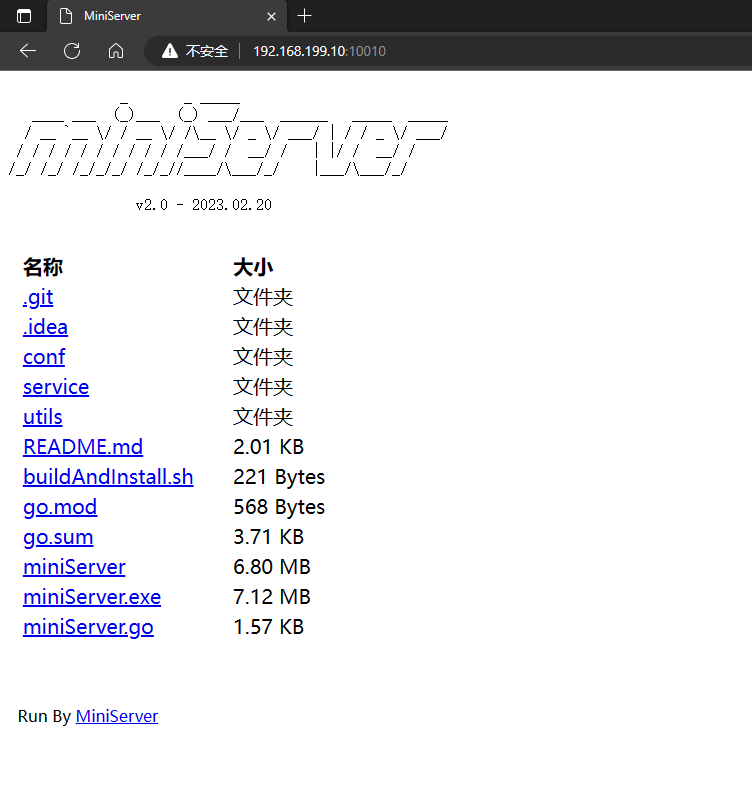

# miniServer

```text
              _       _ _____                          
   ____ ___  (_)___  (_) ___/___  ______   _____  _____
  / __ `__ \/ / __ \/ /\__ \/ _ \/ ___/ | / / _ \/ ___/
 / / / / / / / / / / /___/ /  __/ /   | |/ /  __/ /    
/_/ /_/ /_/_/_/ /_/_//____/\___/_/    |___/\___/_/     
                                                       
```

为当前目录或特定目录开启一个静态 http 服务器

简单实现的一个小玩意儿，这些年帮了我很多忙~




## 使用教程

### 基本参数
V1.2 版本之后目前所有命令参数都支持 linux / windows

```shell
  -d string
        the dir path the miniServer listen, default is current path
        设置http服务器鉴定目录，默认为当前目录 (default "null")
  -kl
        kill the cross running miniServer
        杀死所有的 miniServer 程序
  -l    list the status of cross running miniServer
        列出当前运行的所有 miniServer 程序
  -p string
        http listen port
        设置 http 服务器运行端口 (default "10010")
  -v    version message
        版本信息查看
```

注意:杀死进程依赖于 bash 里 `kill` 命令和 `netstat` 命令

所以你可能需要安装 `net-tools` 


## 日常用法
 - 调试本地的静态网站工程和本地 Javascript( Chrome 是不允许 js 直接通过 ajax 读取本地文件的, 但是使用静态服务器开启网站的时候就可以)

 - Axure PR 将原型图导出后的 HTML 页面，需要安装 Axure PR 的 chrome 插件才能运行，而如果将 miniServer 放到导出的 html 的文件夹目录下，点击运行之后，就可以直接通过 localhost:10010 这样的地址访问了
 
 - 或者是直接开启一个 wifi 分享，内网环境下其他的机器直接通过访问（本机ip地址:端口）的形式来下载文件
 
## 编译
直接 

    go build miniServer.go

就可以了，交叉编译的话在语句前面加上平台限定就好了
 
如果要方便的话就
    
    sudo cp miniServer /usr/bin

这样就直接变成一个 bash 命令了